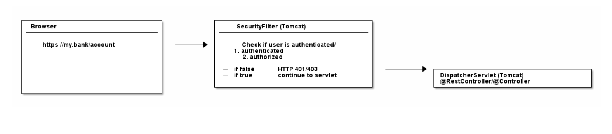

# Spring Security

## Introduction

**Short answer**: Spring Security is a bunch of servlet filters that help you add authentication and authorization to your web application. 

## Web Application Security: 101

**Authentication**: Authentication refers to the process of verifying the identity of a user, based on provided credentials.

**Authorization**: Authorization refers to the process of determining if a user has proper permission to perform a particular action or read particular data, assuming that the user is successfully authenticated. 

**Principal**: Principal refers to the currently authenticated user.

**Granted Authority**: Refers to the permission of the authenticated user.

**Role**: Refers to a group of permissions of the authenticated user.

**Servlet Filters**: 

There is no security hardcoded into the `DispatcherServlet`. Optimally, the authentication and authorization should be done before a request hits your @Controller.

There is a way to do it: you can put filters in front of servlets, which means you could think about writing a SecurityFilter and configure it in your Tomcat to filter every incoming HTTP request before it hits your servlet.



A naive SecurityFilter

```java
import javax.servlet.*;
import javax.servlet.http.HttpFilter;
import javax.servlet.http.HttpServletRequest;
import javax.servlet.http.HttpServletResponse;
import java.io.IOException;

public class SecurityServletFilter extends HttpFilter {

    @Override
    protected void doFilter(HttpServletRequest request, HttpServletResponse response, FilterChain chain) throws IOException, ServletException {
        UsernamePasswordToken token = extractUsernameAndPasswordFromRequest(request);
    }

    

}
```
